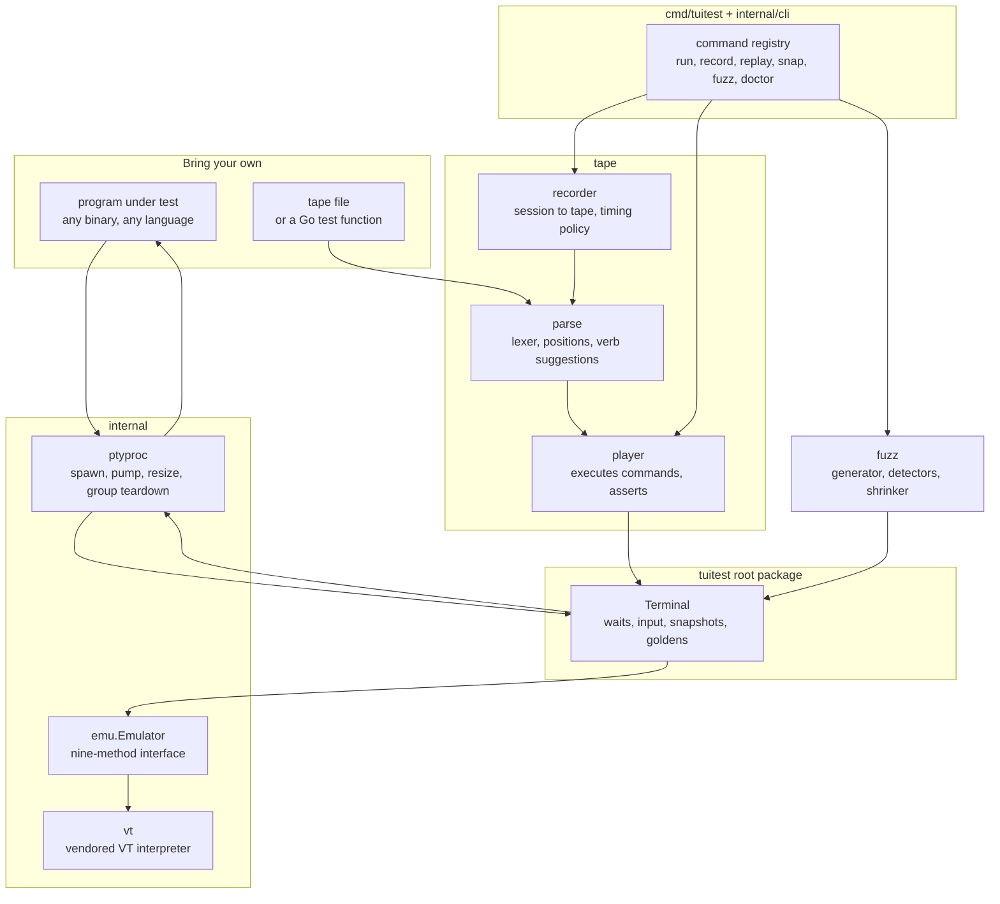
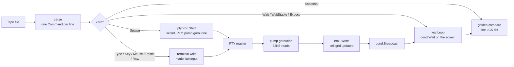

# tuitest

[](https://pkg.go.dev/github.com/Gaurav-Gosain/tuitest)

A headless testing harness for terminal programs in Go.

You bring a terminal program, any language, any framework, and a tape script or
a Go test function. tuitest gives back a real pseudo-terminal to run it on, a VT
emulator that turns its output into a grid of cells, waits that block on screen
state instead of sleeping, and assertions that compare what a user would see.
The module has four direct dependencies (`charmbracelet/ultraviolet` for the
cell model, `charmbracelet/x/ansi` for color parsing, `charmbracelet/x/xpty` for
PTY allocation, `charmbracelet/x/term` for the recorder's raw mode); everything
else in `go.mod` is indirect. There is one binary and one importable package,
and nothing to run alongside them.

It is built to be taken apart. The emulator sits behind `internal/emu.Emulator`,
a nine-method interface; PTY and process lifetime live in `internal/ptyproc` with
no knowledge of screens; the tape language, the CLI command registry, and the
fuzzer are each their own package layered on the same public `Terminal`.

The command line and the Go package are two ways in, and neither is the lesser
one. `tuitest run login.tape` tests a TUI with no Go anywhere; `tuitest.StartT`
does the same thing from a test function when you want the program's own
language. Both drive the same `Terminal`, so a tape and a Go test fail for the
same reasons and print the same screens.

## What it does

- Spawns the program under test on a real pseudo-terminal through `xpty`, so
  `isatty` is true, `TERM` means something, and the program takes its
  interactive code path instead of the piped-output one.
- Interprets everything the program writes with a full VT emulator: cursor
  motion, scroll regions, SGR styling, the alternate screen, wide runes,
  scrollback, mouse mode state, OSC 133 semantic markers.
- Blocks on conditions rather than sleeping. `WaitForText`, `WaitForMatch`,
  `WaitFor` and `WaitForOutput` are woken by the output pump the moment new
  bytes are interpreted, with a 5ms poll as a backstop for wall-clock
  conditions.
- Reports a wait failure as a `*TimeoutError` or `*ClosedError` carrying the
  full screen and the last 4KB of PTY traffic, so a CI log shows what was on
  screen instead of a bare "timeout".
- Sends named keys as typed `Key` constants, so a misspelled key is a compile
  error; `Ctrl('b')` builds a control byte and `Alt(k)` prefixes with ESC.
- Sends mouse events as SGR (mode 1006) sequences, and pastes as bracketed
  paste (mode 2004), which is the code path a program handles differently from
  typed text and usually tests less.
- Resizes the PTY so the child receives a genuine `SIGWINCH`, and resizes the
  emulator grid to match in the same call.
- Tears the child down by process group: the child is started under `setsid`
  with the PTY as its controlling terminal, and `Close` signals the whole group
  with SIGTERM then SIGKILL, so a multiplexer's daemon and its pane processes do
  not survive the test.
- Reports whether the program restored the terminal. `TermState.Dirty()` is true
  when the alternate screen, mouse tracking (modes 9/1000/1001/1002/1003),
  bracketed paste, focus reporting, or a hidden cursor is left set on exit.
- Separates signal death from a non-zero exit through `ExitStatus`, which
  `ExitCode` alone flattens to -1, and treats SIGTERM, SIGKILL, SIGINT, SIGHUP
  and SIGPIPE as routine teardown rather than a crash.
- Writes golden files in two encodings: plain text, and a styled encoding of
  each row's text followed by indented attribute runs, diffed in-process with a
  line LCS so nothing shells out to system `diff`.
- Runs tape scripts, a line-oriented language of 19 verbs covering exactly the
  harness primitives, with parse errors reported by file, line, column, and a
  caret under the offending token.
- Records a live session into a tape: it connects the program to your terminal,
  decodes the input you send back into `Key` and `Type` commands, and chooses a
  `Wait` on new distinctive screen text wherever the screen settled, falling
  back to `WaitStable` and never emitting `Sleep` unless asked.
- Replays a tape onto your terminal so you can watch it, rendering assertion
  failures as two screens side by side with a `|` against every differing row.
- Fuzzes any terminal program with structured input (text mixing ASCII, CJK,
  emoji and combining marks; coherent mouse drags; degenerate resizes; malformed
  UTF-8 and truncated escape sequences), detects crashes, hangs, dirty
  terminals, inconsistent screen state and RSS growth, and minimises each
  finding by delta debugging into a tape that replays it.
- Diagnoses the environment with `tuitest doctor`: PTY allocation, platform,
  `TERM`, size handling, emulator capabilities, and the conditions that make a
  suite flaky. It spawns nothing and writes nothing.
- Exits with codes CI can branch on: 0 pass, 1 assertion failed, 2 bad usage or
  malformed tape, 3 harness error, 4 wait timed out.

## Design goals

- **Black box.** The program under test is a binary behind a PTY. Nothing in the
  harness knows about Bubble Tea, ratatui, ncurses, or any framework, so the
  same test works against a Go TUI, a C one, or `vim`.
- **Deterministic.** Waits block on conditions and are woken by output, so a
  test runs as fast as the program does and does not get slower or flakier on a
  loaded runner. `Sleep` exists in the tape language and `-strict` rejects it.
- **Legible failure.** Every failure carries the screen. A timeout names what it
  waited for and for how long; a failed `Expect` finds the closest line and
  marks the first differing column; a parse error points at the token.
- **Replaceable parts.** The emulator, the PTY layer, the tape language and the
  CLI are separate packages with narrow seams, and the emulator in particular is
  internal on purpose so swapping it is not a breaking change.
- **Honest.** The docs state which waits are exact conditions and which are
  heuristics, which platform is unsupported and why, and where the vendored
  emulator can drift. Performance numbers carry the machine they were measured
  on. See [docs/limits.md](docs/limits.md).

## Architecture



Only the root package is public API; `internal/emu`, `internal/vt` and
`internal/ptyproc` are not importable, which is deliberate. The emulator choice
is not part of the contract, so replacing it is not a breaking change, and the
`vt` copy can be re-synced from upstream without any downstream ceremony.

`ptyproc` owns process and PTY lifetime and knows nothing about screens;
`Terminal` owns screens and waits and knows nothing about `exec`. That split is
what lets the fuzzer drive a `Terminal` while watching the process from outside
it, using `Progress()` for liveness and `ExitStatus()` for cause of death.

The `fuzz` package generates `tape.Command` values, not bytes. Candidates replay
through the same player `tuitest run` uses, which is what makes a minimised
reproduction trustworthy: it is not a description of what the fuzzer did, it is
the same execution path.

## How a tape becomes assertions



Every wait shares one loop. It holds the terminal lock, evaluates its condition,
and blocks on a `sync.Cond` that the output pump broadcasts after each chunk is
interpreted; a 5ms timer re-broadcasts so wall-clock conditions such as
`WaitStable` still make progress when the program is silent. Conditions build a
screen snapshot only if they need one, so a cheap condition does not pay to
rebuild the grid on every write during a heavy burst.

`WaitStable` is the one heuristic here, and it is easy to misuse. It measures its
quiet window from the later of the last output byte and the last input tuitest
sent, which stops it from reporting the pre-keystroke screen as stable, but a
program that takes longer than the interval (150ms by default) to produce its
first byte is still reported stable early. `WaitForOutput` is the primitive for
"wait until the program reacts to what I just sent"; prefer waiting on the
content you expect whenever you know it.

## Quick start

```bash
# install the command line tool (no Go needed afterwards to run tapes)
go install github.com/Gaurav-Gosain/tuitest/cmd/tuitest@latest

# check this machine can run a TUI at all; exits 3 if not, so it gates CI
tuitest doctor

# look at what a program actually draws, asserting nothing
tuitest snap -- htop

# write what you saw as a tape
cat > login.tape <<'EOF'
Set Size 60 10
Spawn less README.md
Wait /tuitest/
Expect /headless testing harness/
Key q
ExpectExit 0
EOF

# run it: exits 0 when every assertion holds, prints the screen when one does not
tuitest run login.tape
```

The loop is `snap` to look, `record` or an editor to write, `run` in CI,
`replay` to debug, `fuzz` to go looking for trouble:

```bash
tuitest record -o login.tape -- ./myapp   # drive it by hand, Ctrl+] to stop
tuitest replay login.tape                 # watch the tape run
tuitest fuzz -duration 30s -corpus ./corpus -- ./myapp
```

From Go, `go get github.com/Gaurav-Gosain/tuitest` and:

```go
func TestGreeting(t *testing.T) {
    term := tuitest.StartT(t, []string{"./myapp"}, tuitest.WithSize(80, 24))

    if err := term.WaitForText("ready", 5*time.Second); err != nil {
        t.Fatal(err)
    }
    term.SendKeys("hello", tuitest.Enter)
    if err := term.WaitForText("you said hello", 3*time.Second); err != nil {
        t.Fatal(err)
    }
    term.AssertGolden(t, "greeting") // testdata/greeting.golden
}
```

`StartT` mirrors PTY traffic into `t.Log`, registers `Close` through
`t.Cleanup`, and fails the test if the spawn itself fails. Record the golden
once with `UPDATE_GOLDEN=1 go test ./...`, then review it as part of the diff.
The full Go surface is in [docs/api.md](docs/api.md).

Requirements: a Unix-like OS that can open PTYs (`/dev/ptmx`), and Go 1.25 or
newer to install. Windows deliberately fails to build; see
[docs/limits.md](docs/limits.md).

## Command line

```
tuitest run         play a tape script against a program            # exit 0/1/2/3/4
tuitest record      drive a program by hand and write a tape        # Ctrl+] to stop
tuitest replay      play a tape onto this terminal so you can watch # -step, -speed
tuitest snap        spawn, wait for quiet, print the screen         # asserts nothing
tuitest fuzz        drive with randomised input, report what breaks # writes tape repros
tuitest doctor      report on the environment tests will run in     # spawns nothing
tuitest completion  print a bash, zsh or fish completion script     # from the registry
tuitest version     print the tuitest version                       # set by -ldflags -X
tuitest help        show help for a command                         # tuitest help run
```

Every command has its own help with examples (`tuitest help run`), and the
completion script is generated from the same registry the dispatcher uses, so it
cannot fall out of step with the commands. `run`, `snap` and `doctor` accept
`-json` and print one object to stdout: `run` reports `status`, a `kind` naming
the exit code, `durationMs`, and the full error text including the screen at the
moment of failure.

A flag beats the tape's own `Set` line for the same setting, which is what makes
`tuitest run -size 120x40 login.tape` useful for checking a layout at a second
size without editing the file; `-env` accumulates instead, since environment
entries add up. Put `--` before the program in `snap`, `record` and `fuzz` so its
own flags are not read as tuitest's. `run -strict` rejects `Sleep`, which is a
cheap way to keep a suite honest. An unknown subcommand or a misspelled tape
verb gets a nearest-match suggestion rather than a bare rejection.

Exit codes are the contract with CI, separating "your program is wrong" from
"the tool could not run it":

| Code | Meaning |
| ---- | ------- |
| 0 | every assertion passed |
| 1 | an assertion failed, or the program exited before a wait was satisfied |
| 2 | bad usage, or a tape that would not parse |
| 3 | harness error: no PTY, a program that would not start, an unreadable golden |
| 4 | a wait timed out |

The full flag reference for every subcommand is in [docs/cli.md](docs/cli.md).

## The tape language

A tape is line oriented, one command per line, `#` starts a comment.

```
Set Size 40 10
Set Term xterm-256color
Spawn ./myapp
Wait /ready/ +Screen @5s
Type hello
Key Enter
Wait /you said hello/ @5s
Snapshot after-hello +Styled
Resize 60 20
Mouse Press Left 10 5 +Ctrl
Raw "\x1b[1;2;3m"
ExpectExit 0
```

The 19 verbs are `Set`, `Spawn`, `Type`, `Key`, `Wait`, `WaitStable`,
`WaitOutput`, `WaitPrompt`, `WaitCommand`, `Expect`, `ExpectExit`, `Snapshot`,
`Resize`, `Mouse`, `Paste`, `Raw`, `Hide`, `Show` and `Sleep`. Wait-like
commands take an optional `/regex/`, a `+Screen` or `+Line` scope, and an
`@timeout` such as `@5s`. `Paste` and `Raw` take a Go-quoted string, which is
what lets them carry arbitrary bytes including malformed UTF-8 and embedded
escape sequences. The grammar, the `Set` keys, and the validation limits are in
[docs/tape.md](docs/tape.md).

## Fuzzing a TUI

`tuitest fuzz` drives a program with randomised but structured input and reports
five kinds of finding: `crash`, `hang`, `dirty-terminal`, `screen-inconsistent`,
and `memory-growth` (Linux only, off unless `-max-memory-growth` is set). A
clean exit is never a finding, because the fuzzer sends keys that legitimately
quit a program and treating that as a bug would make every run a false positive.

`dirty-terminal` is the highest-value check in practice: it is a real bug class,
it is common, and unlike the others it has almost no false-positive surface,
because a program that turned a mode on is unambiguously responsible for turning
it off. Hang detection is the one heuristic, and it is tuned to stay quiet
rather than to catch everything.

Every finding is minimised by delta debugging and written as an ordinary tape:

```
# crash: program killed by aborted
# found by tuitest fuzz at seed 13064056694810536104, iteration 6
# minimised from 31 commands to 3
#
# replay with: tuitest run <this file>

Spawn htop
Resize 1 1
Raw "hel"
```

That is a real reproduction, minimised from 31 commands to 3: a buffer overflow
in htop 3.5.1, caught by glibc's fortify check. With `-corpus dir` findings are
saved there and replayed first on the next run, so a fix is confirmed when the
corpus stops reproducing. See [docs/fuzzing.md](docs/fuzzing.md).

## Performance

Measured on an Intel i7-10700 (16 threads, Linux), 80-column grid, five runs of
`go test -run '^$' -bench . -benchtime 3s .`, reproducible from `bench_test.go`
in the root package. Ranges rather than single figures, because this was an
otherwise-busy desktop and the spread is real.

| Workload | Lines per second | Bytes per second |
| --- | --- | --- |
| Plain 80-column text lines | 64,000 to 68,000 | 5.2 to 5.5 MB/s |
| Same with an SGR change per line | 44,000 to 66,000 | 4.3 to 6.4 MB/s |

The emulator is the only component in the read path that scales with output
volume, and it is single-threaded by construction: a VT interpreter is a state
machine over an ordered byte stream, so adding concurrency cannot make this
faster. A program that emits far more than this feels PTY backpressure rather
than losing data, so heavy-output tests need timeouts sized for the volume, not
for the harness.

Waits themselves cost nothing while idle: they block on a condition variable and
are woken by the pump, so a suite's wall-clock time is the program's own latency
plus at most the 5ms poll interval per wall-clock condition.

## Limitations

The full list, with the reasoning, is in [docs/limits.md](docs/limits.md). The
ones most likely to matter:

- **Unix only, and it fails to build on Windows on purpose.** There is no ConPTY
  backend and no process group to signal, so teardown could not keep its
  promise; the package produces a named compile error rather than building into
  something that looks supported and leaks every grandchild. Use WSL or a Unix
  runner.
- **`WaitStable` is a heuristic** and always will be. A program slower than the
  stabilize interval to produce its first byte is reported stable early. Wait on
  content when you know it.
- **The VT emulator is a vendored copy** of tuios's interpreter, not a
  dependency, so it does not pick up upstream fixes automatically. The exact
  commit is in `internal/vt/UPSTREAM`, the policy in `internal/vt/VENDOR.md`,
  and `scripts/vendor-vt.sh -n /path/to/tuios` reports drift without changing
  anything. Fixes go to tuios first; a change made only in the copy is lost at
  the next sync.
- **`Screen.Line` returns one physical row** and does not de-wrap, and `Cell`
  exposes only a cell's first rune, so combining marks are invisible to
  assertions.
- **`SendMouse` speaks only SGR (1006)**, and `tuitest record` does not decode
  incoming mouse reports back into `Mouse` commands: they reach the program and
  are then counted and dropped, with a warning, so a recording of a
  mouse-driven session is not a complete replay.
- **Two of the fuzzer's own tests are flaky under load.** They assert that a
  minimised reproduction re-reproduced on the confirmation replay, which is a
  property the fuzzer does not guarantee: confirmation drives a real program
  through a real PTY. They pass in isolation and fail intermittently when the
  machine is busy. See [docs/limits.md](docs/limits.md).
- **Fuzz generation is blind.** There is no coverage instrumentation of the
  program under test, so input comes from a structural model rather than being
  steered toward new code paths. It finds shallow bugs quickly and deep ones
  only by luck.

## Comparison

**teatest** (`charmbracelet/x/exp/teatest`) drives a Bubble Tea program in
process, which is fast and lets it reach into the model, but it only works for
Bubble Tea and it tests the program rather than the terminal: no PTY, so it
cannot tell you what a real terminal would show. tuitest is the opposite trade,
a black box behind a real PTY, slower, with no access to internal state. If you
write Bubble Tea and want fast unit tests of your update loop, use teatest; if
you want to know what the user sees, or you do not control the source, use this.

**expect and its descendants** (`expect`, `pexpect`, `go-expect`) also drive a
PTY and are excellent at line-oriented conversations: log in, wait for a prompt,
send a password. They match against the byte stream, which is exactly wrong for
a full-screen program, because a TUI's bytes are cursor movements and partial
redraws that never contain the final text in reading order. tuitest interprets
those bytes into a screen first, which is the whole difference.

**VHS** records terminal sessions to GIFs and has a tape format that inspired
this one. It is a demo tool, not an assertion tool; tuitest's tape language
covers the harness primitives and produces golden text, not video.

## Extending

Each seam is narrow on purpose:

- Swap the VT emulator (implement `internal/emu.Emulator`, nine methods).
- Add a CLI subcommand (append one `*Command` to `Commands()`; help, completion
  and typo suggestions follow automatically).
- Add a tape verb (one `Kind`, one `Verb()` case, one parse case, one player
  case, one printer case).
- Drive the harness from your own runner (import the root package; `tape` and
  `fuzz` are both ordinary callers of `*Terminal`).
- Add project-specific helpers alongside `tuiosx` (69 lines) rather than in the
  core.

See [docs/architecture.md](docs/architecture.md) and
[docs/extending.md](docs/extending.md).

## Tests

```bash
go build ./...
go vet ./...
go test -race ./...
```

367 test cases across 163 test functions and 5 fuzz targets. The default suite is
hermetic: it spawns a small Go echo-TUI fixture under `testdata/echotui`, a
deliberately buggy fixture with individually selectable bugs under
`testdata/buggytui`, and a plain `sh`. Nothing external is required.

Everything that parses input tuitest does not control has a fuzz target
(`FuzzParse`, `FuzzResolveKey`, `FuzzDiff`, `FuzzStyledEncode`,
`FuzzEmulatorScreen`). Their seed corpora live in `testdata/fuzz`, so `go test`
runs them as ordinary unit tests and they act as regression guards with no
fuzzing session. To actually fuzz:

```bash
go test -run '^$' -fuzz FuzzParse ./tape
go test -run '^$' -fuzz FuzzEmulatorScreen .
```

Two suites are opt-in because they need a multiplexer.
`TUITEST_TUIOS=1 go test -race ./tuiosx/...` runs the tuios acceptance tests,
and the examples under `examples/tuios` skip themselves unless a tuios binary is
found through `TUIOS_BIN` or `PATH`. They are worth reading as realistic usage
even if you never run them: boot and window management, a control plane driven
over a unix socket with a TUI later attached to the same session, and a
flood-plus-resize stress test. Set `TUITEST_TUIOS_SRC` to a tuios checkout to
have the suite also check the vendored emulator against the commit recorded in
`internal/vt/UPSTREAM`.

## Project

- [docs/architecture.md](docs/architecture.md), how the packages fit together
- [docs/api.md](docs/api.md), the Go API
- [docs/cli.md](docs/cli.md), every subcommand and flag
- [docs/tape.md](docs/tape.md), the tape grammar
- [docs/fuzzing.md](docs/fuzzing.md), what the fuzzer sends and detects
- [docs/extending.md](docs/extending.md), the seams
- [docs/limits.md](docs/limits.md), the hard edges

## License

MIT. See [LICENSE](LICENSE).

The vendored VT emulator under `internal/vt` is copied from tuios, which is also
MIT licensed by the same author.
