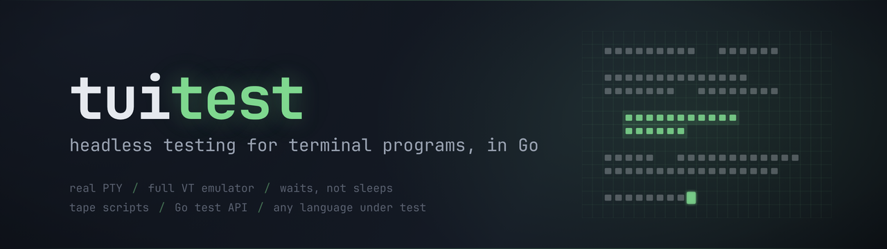
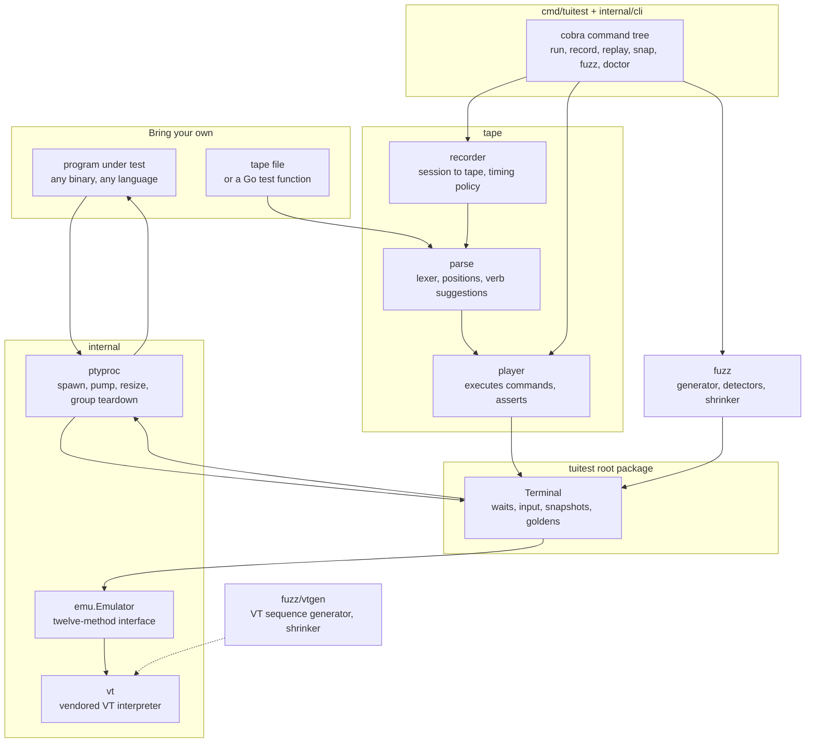
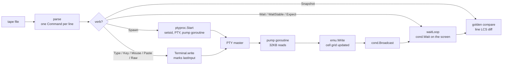
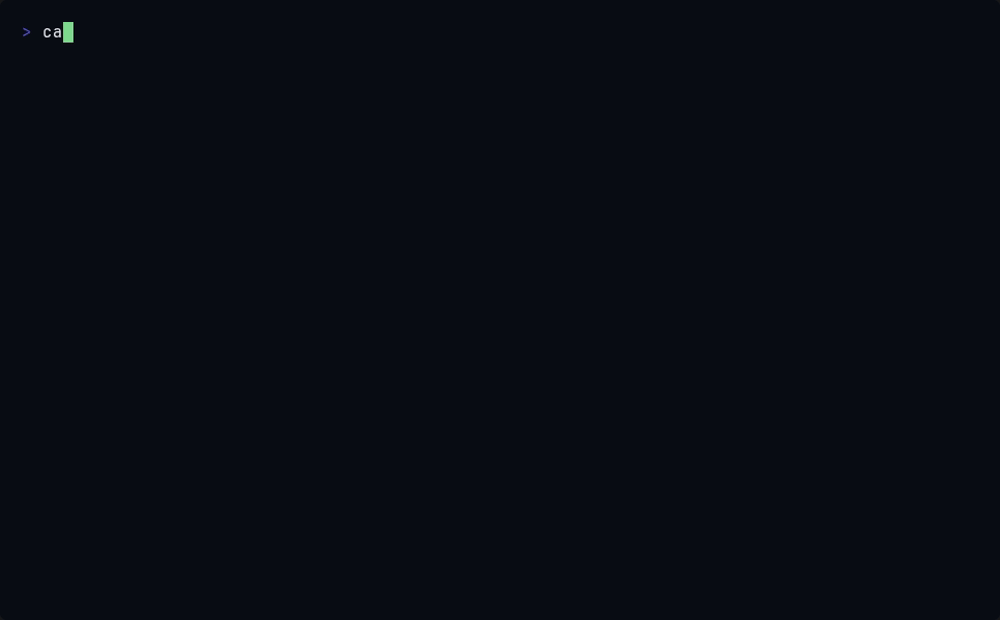
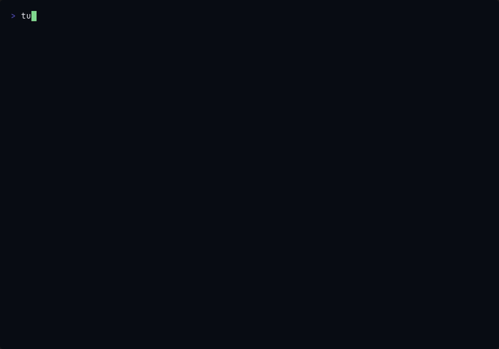
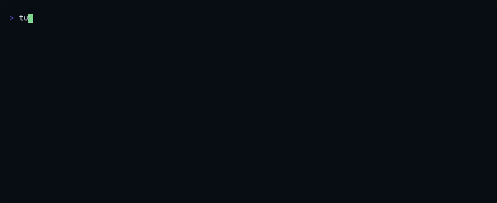

<p align="center">
  
</p>

# tuitest

[](https://pkg.go.dev/github.com/Gaurav-Gosain/tuitest)

A headless testing harness for terminal programs in Go.

<p align="center">
  
</p>
<p align="center">
  <sub>every keypress, click, scroll and assertion above is tuitest driving the real program, and the pane below it is tuitest's own trace of what it sent</sub>
</p>

You bring a terminal program, any language, any framework, and a tape script or
a Go test function. tuitest gives back a real pseudo-terminal to run it on, a VT
emulator that turns its output into a grid of cells, waits that block on screen
state instead of sleeping, and assertions that compare what a user would see.

The command line and the Go package are two ways in, and neither is the lesser
one. `tuitest run login.tape` tests a TUI with no Go anywhere; `tuitest.StartT`
does the same thing from a test function. Both drive the same `Terminal`, so a
tape and a Go test fail for the same reasons and print the same screens.

## Quick start

You need a Unix-like OS that can open PTYs (`/dev/ptmx`) and Go 1.25 or newer
to install. Windows deliberately fails to build; see
[docs/limits.md](docs/limits.md).

### From the command line

```bash
go install github.com/Gaurav-Gosain/tuitest/cmd/tuitest@latest

# check this machine can run a TUI at all; exits 3 if not, so it gates CI
tuitest doctor

# look at what a program draws, asserting nothing
printf 'hello from tuitest\n' > note.txt
tuitest snap --size 60x8 -- less note.txt

# write down what should happen as a tape
cat > first.tape <<'EOF'
Set Size 60 8
Spawn less note.txt
Wait /hello from tuitest/
Key q
ExpectExit 0
EOF

# run it: silent and exit 0 when every assertion holds,
# the screen and a non-zero exit code when one does not
tuitest run first.tape
```

From there the loop is `snap` to look, `record` or an editor to write a tape,
`run` in CI, `replay` to watch a failing tape, and `fuzz` to go looking for
trouble:

```bash
tuitest record -o login.tape -- ./myapp   # drive it by hand, Ctrl+] to stop
tuitest replay login.tape                 # watch the tape run
tuitest fuzz --duration 30s --corpus ./corpus -- ./myapp
```

[examples/tapes](examples/tapes) has a runnable tape for every verb of the
language.

### From Go

```bash
go get github.com/Gaurav-Gosain/tuitest
```

```go
package myapp_test

import (
	"testing"
	"time"

	"github.com/Gaurav-Gosain/tuitest"
)

func TestGreeting(t *testing.T) {
	// Any argv works; this one is a tiny program that asks for a name.
	prog := []string{"sh", "-c", `printf 'name? '; read name; printf 'hello, %s\n' "$name"`}
	term := tuitest.StartT(t, prog, tuitest.WithSize(40, 5))

	if err := term.WaitForText("name?", 5*time.Second); err != nil {
		t.Fatal(err)
	}
	if err := term.SendKeys("gopher", tuitest.Enter); err != nil {
		t.Fatal(err)
	}
	if err := term.WaitForText("hello, gopher", 5*time.Second); err != nil {
		t.Fatal(err) // the error carries the screen as it was
	}
	term.AssertGolden(t, "greeting") // compares against testdata/greeting.golden
}
```

`StartT` mirrors PTY traffic into `t.Log`, registers `Close` through
`t.Cleanup`, and fails the test if the spawn itself fails. Record the golden
once with `UPDATE_GOLDEN=1 go test ./...`, then review it as part of the diff.
It holds `name? hello, gopher`: the PTY does not echo input, so the screen shows
only what the program drew (see [docs/limits.md](docs/limits.md#fidelity-gaps)).

The full Go surface is in [docs/api.md](docs/api.md), and every example in
[example_test.go](example_test.go) runs under `go test` and is shown on
[pkg.go.dev](https://pkg.go.dev/github.com/Gaurav-Gosain/tuitest).

## What it does

- Spawns the program under test on a real pseudo-terminal through `xpty`, so
  `isatty` is true, `TERM` means something, and the program takes its
  interactive code path instead of the piped-output one.
- Interprets everything the program writes with a full VT emulator: cursor
  motion, scroll regions, SGR styling, the alternate screen, wide runes,
  scrollback, mouse mode state, OSC 133 semantic markers.
- Blocks on conditions rather than sleeping. `WaitForText`, `WaitForMatch`,
  `WaitFor` and `WaitForOutput` are woken by the output pump the moment new
  bytes are interpreted, with a 5ms poll as a backstop for wall-clock
  conditions. `WaitForStable` also waits for the frame the condition matched to
  finish drawing.
- Never shows a half-drawn frame from a program that uses synchronized output
  (mode 2026, which every Bubble Tea v2 program does): while an update is open,
  the screen the waits and `Screen` see is the last complete frame, as on a real
  terminal.
- Reports a wait failure as a `*TimeoutError` or `*ClosedError` carrying the
  full screen and the last 4KB of PTY traffic, so a CI log shows what was on
  screen instead of a bare "timeout".
- Sends named keys as typed `Key` constants, so a misspelled key is a compile
  error; `Ctrl('b')` builds a control byte and `Alt(k)` prefixes with ESC. The
  arrow keys, Home and End follow the program's cursor key mode (DECCKM), as
  they do on a real terminal.
- Sends mouse events as SGR (mode 1006) sequences, and pastes as bracketed
  paste (mode 2004), which is the code path a program handles differently from
  typed text and usually tests less.
- Resizes the PTY so the child receives a genuine `SIGWINCH`, and resizes the
  emulator grid to match in the same call.
- Tears the child down by process group: the child is started under `setsid`
  with the PTY as its controlling terminal, and `Close` signals the whole group,
  plus any descendant that left it with `setsid`, with SIGTERM then SIGKILL, so
  a multiplexer's daemon and its pane processes do not survive the test. `Close`
  returns an error naming anything that did, and `StartT` fails the test with it.
- Reports whether the program restored the terminal. `TermState.Dirty()` is true
  when the alternate screen, mouse tracking (modes 9/1000/1001/1002/1003),
  bracketed paste, focus reporting, or a hidden cursor is left set on exit.
- Separates signal death from a non-zero exit through `ExitStatus`, which
  `ExitCode` alone flattens to -1, and treats SIGTERM, SIGKILL, SIGINT, SIGHUP
  and SIGPIPE as routine teardown rather than a crash.
- Writes golden files in two encodings: plain text, and a styled encoding of
  each row's text followed by indented attribute runs, diffed in-process with a
  line LCS so nothing shells out to system `diff`.
- Runs tape scripts, a line-oriented language of 20 verbs covering exactly the
  harness primitives, with parse errors reported by file, line, column, and a
  caret under the offending token.
- Records a live session into a tape: it connects the program to your terminal,
  decodes the input you send back into `Key` and `Type` commands, and chooses a
  `Wait` on new distinctive screen text wherever the screen settled, falling
  back to `WaitStable` and never emitting `Sleep` unless asked.
- Replays a tape onto your terminal so you can watch it, rendering assertion
  failures as two screens side by side with a `|` against every differing row.
- Fuzzes any terminal program with structured input (text mixing ASCII, CJK,
  emoji and combining marks; coherent mouse drags; degenerate resizes; malformed
  UTF-8 and truncated escape sequences), detects crashes, hangs, dirty
  terminals, inconsistent screen state and RSS growth, and minimises each
  finding by delta debugging into a tape that replays it.
- Diagnoses the environment with `tuitest doctor`: PTY allocation, platform,
  `TERM`, size handling, emulator capabilities, and the conditions that make a
  suite flaky. It spawns nothing and writes nothing.
- Exits with codes CI can branch on: 0 pass, 1 assertion failed, 2 bad usage or
  malformed tape, 3 harness error, 4 wait timed out, 5 snap saw an empty screen.

## Design goals

- **Black box.** The program under test is a binary behind a PTY. Nothing in the
  harness knows about Bubble Tea, ratatui, ncurses, or any framework, so the
  same test works against a Go TUI, a C one, or `vim`.
- **Deterministic.** Waits block on conditions and are woken by output, so a
  test runs as fast as the program does and does not get slower or flakier on a
  loaded runner. `Sleep` exists in the tape language and `-strict` rejects it.
- **Legible failure.** Every failure carries the screen. A timeout names what it
  waited for and for how long; a failed `Expect` finds the closest line and
  marks the first differing column; a parse error points at the token.
- **Replaceable parts.** The emulator, the PTY layer, the tape language and the
  CLI are separate packages with narrow seams, and the emulator in particular is
  internal on purpose so swapping it is not a breaking change.
- **Honest.** The docs state which waits are exact conditions and which are
  heuristics, which platform is unsupported and why, and where the vendored
  emulator can drift. Performance numbers carry the machine they were measured
  on. See [docs/limits.md](docs/limits.md).

## Architecture


```mermaid
flowchart TB
  subgraph Bring["Bring your own"]
    PROG[program under test<br/>any binary, any language]
    TAPE[tape file<br/>or a Go test function]
  end

  subgraph CLI["cmd/tuitest + internal/cli"]
    REG[cobra command tree<br/>run, record, replay, snap, fuzz, doctor]
  end

  subgraph Lang["tape"]
    PARSE[parse<br/>lexer, positions, verb suggestions]
    PLAY[player<br/>executes commands, asserts]
    REC[recorder<br/>session to tape, timing policy]
  end

  subgraph Core["tuitest root package"]
    TERM[Terminal<br/>waits, input, snapshots, goldens]
  end

  subgraph Low["internal"]
    PTY[ptyproc<br/>spawn, pump, resize, group teardown]
    EMU[emu.Emulator<br/>twelve-method interface]
    VT[vt<br/>vendored VT interpreter]
  end

  FUZZ[fuzz<br/>generator, detectors, shrinker]
  VTGEN[fuzz/vtgen<br/>VT sequence generator, shrinker]

  TAPE --> PARSE --> PLAY --> TERM
  REG --> PLAY
  REG --> REC --> PARSE
  REG --> FUZZ --> TERM
  TERM --> PTY --> PROG
  PROG --> PTY --> TERM --> EMU --> VT
  VTGEN -.-> VT
```

Only the root package is public API; `internal/emu`, `internal/vt` and
`internal/ptyproc` are not importable, which is deliberate. The emulator choice
is not part of the contract, so replacing it is not a breaking change, and the
`vt` copy can be re-synced from upstream without any downstream ceremony.

The importable library has four direct dependencies (`charmbracelet/ultraviolet`
for the cell model, `charmbracelet/x/ansi` for color parsing,
`charmbracelet/x/xpty` for PTY allocation, `charmbracelet/x/term` for the
recorder's raw mode). `spf13/cobra` and `charmbracelet/fang` are in `go.mod`
for the command line, but nothing outside `cmd/tuitest` and `internal/cli`
imports them, so they never reach a consumer's binary.

`ptyproc` owns process and PTY lifetime and knows nothing about screens;
`Terminal` owns screens and waits and knows nothing about `exec`. That split is
what lets the fuzzer drive a `Terminal` while watching the process from outside
it, using `Progress()` for liveness and `ExitStatus()` for cause of death.

The `fuzz` package generates `tape.Command` values, not bytes. Candidates replay
through the same player `tuitest run` uses, which is what makes a minimised
reproduction trustworthy: it is not a description of what the fuzzer did, it is
the same execution path.

`fuzz/vtgen` points the other way. It generates the bytes a program writes,
by grammar rather than by byte, for testing whatever parses them: tuitest aims
it at its own emulator, and it is public so anything else with a VT parser can
aim it at theirs. See [docs/fuzzing.md](docs/fuzzing.md).

## How a tape becomes assertions


```mermaid
flowchart LR
  T[tape file] --> P[parse<br/>one Command per line]
  P --> R{verb?}
  R -- Spawn --> S[ptyproc.Start<br/>setsid, PTY, pump goroutine]
  R -- "Type / Key / Mouse / Paste / Raw" --> W[Terminal.write<br/>marks lastInput]
  R -- "Wait / WaitStable / Expect" --> C[waitLoop<br/>cond.Wait on the screen]
  R -- Snapshot --> G[golden compare<br/>line LCS diff]
  S --> PT[PTY master]
  W --> PT
  PT --> PUMP[pump goroutine<br/>32KB reads]
  PUMP --> E[emu.Write<br/>cell grid updated]
  E --> B[cond.Broadcast]
  B --> C
  C --> G
```

Every wait shares one loop. It holds the terminal lock, evaluates its condition,
and blocks on a `sync.Cond` that the output pump broadcasts after each chunk is
interpreted; a 5ms timer re-broadcasts so wall-clock conditions such as
`WaitStable` still make progress when the program is silent. Conditions build a
screen snapshot only if they need one, so a cheap condition does not pay to
rebuild the grid on every write during a heavy burst, and a snapshot is reused
until the grid changes, so a wait on a quiet screen costs next to nothing.

`WaitStable` is the one heuristic here, and it is easy to misuse. It measures its
quiet window from the later of the last output byte and the last input tuitest
sent, which stops it from reporting the pre-keystroke screen as stable, and it
never settles before the program's first byte, but a program that takes longer
than the interval (150ms by default) to react to input is still reported stable
early. `WaitForOutput` is the primitive for "wait until the program reacts to
what I just sent", and `WaitForStable` for "wait until this is on screen and the
frame has finished drawing"; prefer waiting on the content you expect whenever
you know it.

## What it looks like

Every recording below drives the real binary against a real program: `less`
paging this repository's README, `vim` opening a file from `scripts/`, and the
deliberately broken fixture in `testdata/buggytui`. The recording at the top of
this page drives `lazygit` the same way. The tapes that produce them are in
[scripts/demo](scripts/demo) and regenerate with `scripts/demo/record.sh`.

<table>
  <tr>
    <td></td>
  </tr>
  <tr>
    <td align="center"><sub>a tape testing a program with no Go anywhere, and what a stale assertion prints when it fails</sub></td>
  </tr>
  <tr>
    <td></td>
  </tr>
  <tr>
    <td align="center"><sub>snap printing what a program draws, then the same program at a second width</sub></td>
  </tr>
  <tr>
    <td></td>
  </tr>
  <tr>
    <td align="center"><sub>fuzzing a fixture that panics on F5, minimised to a two-line tape that replays it</sub></td>
  </tr>
</table>

## Command line

```
tuitest run         play a tape script against a program            # exit 0 to 4
tuitest record      drive a program by hand and write a tape        # Ctrl+] to stop
tuitest replay      play a tape onto this terminal so you can watch # -step, -speed
tuitest snap        spawn, wait for quiet, print the screen         # asserts nothing
tuitest fuzz        drive with randomised input, report what breaks # writes tape repros
tuitest doctor      report on the environment tests will run in     # spawns nothing
tuitest completion  print a bash, zsh, fish or powershell script    # cobra generated
tuitest version     print the tuitest version                       # module or -ldflags version
tuitest help        show help for a command                         # tuitest help run
```

Every command has its own help with examples (`tuitest help run`). Commands,
help and completion are built on `spf13/cobra` and rendered by
`charmbracelet/fang`; completion is resolved by calling the binary back rather
than from a script baked at build time, so it cannot fall out of step with the
commands. Flags take either spelling: `-size` and `--size` both work. `run`,
`snap` and `doctor` accept `-json` and print one object to stdout: `run` reports `status`, a `kind` naming
the exit code, `durationMs`, and the full error text including the screen at the
moment of failure.

A flag beats the tape's own `Set` line for the same setting, which is what makes
`tuitest run -size 120x40 login.tape` useful for checking a layout at a second
size without editing the file; `-env` accumulates instead, since environment
entries add up. Put `--` before the program in `snap`, `record` and `fuzz` so its
own flags are not read as tuitest's. `run -strict` rejects `Sleep`, which is a
cheap way to keep a suite honest. An unknown subcommand or a misspelled tape
verb gets a nearest-match suggestion rather than a bare rejection.

Exit codes are the contract with CI, separating "your program is wrong" from
"the tool could not run it":

| Code | Meaning |
| ---- | ------- |
| 0 | every assertion passed |
| 1 | an assertion failed, the program exited before the tape was done with it, or `fuzz` found something |
| 2 | bad usage, or a tape that would not parse |
| 3 | harness error: no PTY, a program that would not start, an unreadable tape or golden |
| 4 | a wait timed out |
| 5 | `snap` only: the program drew nothing |

The full flag reference for every subcommand is in [docs/cli.md](docs/cli.md).

## The tape language

A tape is line oriented, one command per line, and a line starting with `#` is a
comment.

```
Set Size 40 10
Set Term xterm-256color
Spawn ./myapp
Wait /ready/ +Screen @5s
Type hello
Key Enter
Wait /you said hello/ @5s
Snapshot after-hello +Styled
Resize 60 20
Mouse Press Left 10 5 +Ctrl
Raw "\x1b[1;2;3m"
ExpectExit 0
```

The 20 verbs are `Set`, `Spawn`, `Type`, `Key`, `Wait`, `WaitStable`,
`WaitOutput`, `WaitPrompt`, `WaitCommand`, `Expect`, `ExpectExit`, `Snapshot`,
`Resize`, `Mouse`, `Paste`, `Raw`, `Focus`, `Hide`, `Show` and `Sleep`, and
[examples/tapes](examples/tapes) has a runnable tape using each of them. `Wait`
and `Expect` take a `/regex/` and a `+Screen` or `+Line` scope, and every verb
that waits takes an `@timeout` such as `@5s`; an argument a verb does not take
is a parse error. `Paste` and `Raw` take a Go-quoted string, which is what lets
them carry arbitrary bytes including malformed UTF-8 and embedded escape
sequences, and a `Spawn` or `Set` argument containing a space is written the
same way. The grammar, the `Set` keys, and the validation limits are in
[docs/tape.md](docs/tape.md).

A recording never loses input. Every input sequence is decoded by a registered
protocol (the legacy keys, xterm modifyOtherKeys, the kitty keyboard protocol,
the X10, SGR, SGR-pixel and urxvt mouse encodings, bracketed paste and focus
reporting) or, failing that, captured verbatim as a `Raw` command that replays
byte for byte. So a tape is a faithful replay whether or not a decoder exists for
everything in it, and terminal replies to capability queries are never mistaken
for keystrokes. See [docs/input-protocols.md](docs/input-protocols.md) for the
guarantees, the round-trip property, what happens when replay negotiates
different keyboard modes than the recording did, and how to add a protocol.

## Fuzzing a TUI

`tuitest fuzz` drives a program with randomised but structured input and reports
seven kinds of finding: `crash`, `hang`, `dirty-terminal`, `screen-inconsistent`,
`memory-growth` (Linux only, off unless `-max-memory-growth` is set),
`replacement-char` (off unless `-detect-replacement-chars` is set), and
`invariant`. A clean exit is never a finding, because the fuzzer sends keys that
legitimately quit a program and treating that as a bug would make every run a
false positive.

`dirty-terminal` is the highest-value check in practice: it is a real bug class,
it is common, and unlike the others it has almost no false-positive surface,
because a program that turned a mode on is unambiguously responsible for turning
it off. Hang detection is the one heuristic, and it is tuned to stay quiet
rather than to catch everything.

`invariant` is the only oracle that knows anything about your program. Pass
`func(tuitest.Screen) error` closures in `fuzz.Options.Invariants` and a session
can find that a status bar disappeared or a modal was left open, not just that
the program died. A violation is an ordinary finding, so the shrinker minimises
it like any other, and the report names the command after which the property
first failed rather than the one where the checker noticed. It is checked only
after a settle, because a screen caught mid-redraw fails a reasonable invariant.
There is no CLI flag: a tape file cannot carry a Go closure.

`replacement-char` reports U+FFFD reaching the screen, which means the program
mangled a byte sequence between reading it and drawing it. It is off by default
and goes quiet for a run as soon as the fuzzer sends malformed UTF-8, because
against malformed input a replacement character is the correct output rather
than a bug. Both of these are documented with their limits in
[docs/fuzzing.md](docs/fuzzing.md).

Every finding is minimised by delta debugging and written as an ordinary tape:

```
# crash: program killed by aborted
# found by tuitest fuzz at iteration 6, whose own seed is 13064056694810536104:
# --seed 13064056694810536104 --iterations 1 with the same generation flags regenerates the unminimised input
# minimised from 31 commands to 3
#
# replay with: tuitest run <this file>

Spawn htop
Resize 1 1
Raw "hel"

# --- assertion (not replayed by tuitest fuzz) ---
# The bug: this program should still exit cleanly after the input above.
ExpectExit 0
```

That is a real reproduction, minimised from 31 commands to 3: a buffer overflow
in htop 3.5.1, caught by glibc's fortify check. With `-corpus dir` findings are
saved there and replayed first on the next run, so a fix is confirmed when the
corpus stops reproducing. See [docs/fuzzing.md](docs/fuzzing.md).

## Performance

Measured on an Intel i7-10700 (16 threads, Linux), 80-column grid, five runs of
`go test -run '^$' -bench . -benchtime 3s .`, reproducible from `bench_test.go`
in the root package. Ranges rather than single figures, because this was an
otherwise-busy desktop and the spread is real.

| Workload | Lines per second | Bytes per second |
| --- | --- | --- |
| Plain 80-column text lines | 64,000 to 68,000 | 5.2 to 5.5 MB/s |
| Same with an SGR change per line | 44,000 to 66,000 | 4.3 to 6.4 MB/s |

The emulator is the only component in the read path that scales with output
volume, and it is single-threaded by construction: a VT interpreter is a state
machine over an ordered byte stream, so adding concurrency cannot make this
faster. A program that emits far more than this feels PTY backpressure rather
than losing data, so heavy-output tests need timeouts sized for the volume, not
for the harness.

Waits themselves cost nothing while idle: they block on a condition variable and
are woken by the pump, so a suite's wall-clock time is the program's own latency
plus at most the 5ms poll interval per wall-clock condition.

## Limitations

The full list, with the reasoning, is in [docs/limits.md](docs/limits.md). The
ones most likely to matter:

- **Unix only, and it fails to build on Windows on purpose.** There is no ConPTY
  backend and no process group to signal, so teardown could not keep its
  promise; the package produces a named compile error rather than building into
  something that looks supported and leaks every grandchild. Use WSL or a Unix
  runner.
- **`WaitStable` is a heuristic** and always will be. A program slower than the
  stabilize interval to react to input is reported stable early. Wait on content
  when you know it.
- **The VT emulator is a vendored copy** of tuios's interpreter, not a
  dependency, so it does not pick up upstream fixes automatically. The exact
  commit is in `internal/vt/UPSTREAM`, the policy in `internal/vt/VENDOR.md`,
  and `scripts/vendor-vt.sh -n /path/to/tuios` reports drift without changing
  anything. Fixes go to tuios first; a file the copy has to change anyway is
  listed in `internal/vt/DIVERGENCE`, and the sync merges into it rather than
  overwriting it.
- **`Screen.Line` returns one physical row** and does not de-wrap, so text that
  soft-wrapped at the right margin does not match as one string.
- **The PTY does not echo input or turn `Ctrl+c` into SIGINT.** A TUI never
  notices, but a line-oriented program's typed input is not on screen, and
  `Ctrl+c` does not interrupt it.
- **Mouse mode 1005 (UTF-8 coordinates) is not decoded as itself.** It is
  indistinguishable from X10 by construction, so it is read as X10 and the
  coordinates on the `Mouse` line are wrong above column 95. The bytes still
  replay exactly, so this costs readability rather than fidelity.
- **Two of the fuzzer's own tests can be flaky under load.** They assert that a
  minimised reproduction re-reproduced on the confirmation replay, which is a
  property the fuzzer does not guarantee: confirmation drives a real program
  through a real PTY. The macOS failures came from a harness bug that is fixed;
  whether any remain on Linux has not been measured. See
  [docs/limits.md](docs/limits.md).
- **The fuzzer's two oracles are gated, and each gate costs coverage.** The
  replacement-character check goes quiet for a whole run once one malformed byte
  has been sent, which with the default generator is almost immediately.
  User-supplied invariants are judged only at a settle, so a violation that
  repairs itself before the end of an iteration is never seen. Both gates were
  chosen over the alternative because a fuzzer that reports things that are not
  bugs trains you to stop reading it.
- **Fuzz generation is blind.** There is no coverage instrumentation of the
  program under test, so input comes from a structural model rather than being
  steered toward new code paths. It finds shallow bugs quickly and deep ones
  only by luck.

## Comparison

**teatest** (`charmbracelet/x/exp/teatest`) drives a Bubble Tea program in
process, which is fast and lets it reach into the model, but it only works for
Bubble Tea and it tests the program rather than the terminal: no PTY, so it
cannot tell you what a real terminal would show. tuitest is the opposite trade,
a black box behind a real PTY, slower, with no access to internal state. If you
write Bubble Tea and want fast unit tests of your update loop, use teatest; if
you want to know what the user sees, or you do not control the source, use this.

**expect and its descendants** (`expect`, `pexpect`, `go-expect`) also drive a
PTY and are excellent at line-oriented conversations: log in, wait for a prompt,
send a password. They match against the byte stream, which is exactly wrong for
a full-screen program, because a TUI's bytes are cursor movements and partial
redraws that never contain the final text in reading order. tuitest interprets
those bytes into a screen first, which is the whole difference.

**VHS** records terminal sessions to GIFs and has a tape format that inspired
this one. It is a demo tool, not an assertion tool; tuitest's tape language
covers the harness primitives and produces golden text, not video.

## Extending

Each seam is narrow on purpose:

- Swap the VT emulator (implement `internal/emu.Emulator`, twelve methods).
- Add a CLI subcommand (one `*cobra.Command` added in `newRootCommand`; help,
  completion and typo suggestions follow automatically).
- Add a tape verb (one `Kind`, one `Verb()` case, one parse case, one player
  case, one printer case).
- Drive the harness from your own runner (import the root package; `tape` and
  `fuzz` are both ordinary callers of `*Terminal`).
- Add project-specific helpers alongside `tuiosx` rather than in the core.

See [docs/architecture.md](docs/architecture.md) and
[docs/extending.md](docs/extending.md).

## Tests

```bash
go build ./...
go vet ./...
go test -race ./...
```

The default suite is hermetic: it spawns a small Go echo-TUI fixture under
`testdata/echotui`, a deliberately buggy fixture with individually selectable
bugs under `testdata/buggytui`, and a plain `sh`. Nothing external is required.
CI runs the same commands on Linux and macOS; see
[.github/workflows/test.yml](.github/workflows/test.yml).

Everything that parses input tuitest does not control has a fuzz target, among
them `FuzzParse` and `FuzzResolveKey` for the tape language, the `FuzzDecode*`
and `FuzzRecorder*` targets for recorded input, and `FuzzEmulatorScreen` and
`FuzzEmulatorScript` for the emulator (`grep -r 'func Fuzz'` lists them all).
Their seed corpora live in `testdata/fuzz` directories, so `go test` runs them
as ordinary unit tests and they act as regression guards with no fuzzing
session. To actually fuzz:

```bash
go test -run '^$' -fuzz FuzzParse ./tape
go test -run '^$' -fuzz FuzzEmulatorScreen .
```

Two suites are opt-in because they need a multiplexer.
`TUITEST_TUIOS=1 go test -race ./tuiosx/...` runs the tuios acceptance tests,
and the examples under `examples/tuios` skip themselves unless a tuios binary is
found through `TUIOS_BIN` or `PATH`. They are worth reading as realistic usage
even if you never run them: boot and window management, a control plane driven
over a unix socket with a TUI later attached to the same session, and a
flood-plus-resize stress test. Set `TUITEST_TUIOS_SRC` to a tuios checkout to
have the suite also check the vendored emulator against the commit recorded in
`internal/vt/UPSTREAM`.

## Project

- [docs/architecture.md](docs/architecture.md), how the packages fit together
- [docs/api.md](docs/api.md), the Go API
- [docs/cli.md](docs/cli.md), every subcommand and flag
- [docs/tape.md](docs/tape.md), the tape grammar
- [docs/fuzzing.md](docs/fuzzing.md), what the fuzzer sends and detects
- [docs/extending.md](docs/extending.md), the seams
- [docs/limits.md](docs/limits.md), the hard edges

## License

MIT. See [LICENSE](LICENSE).

The vendored VT emulator under `internal/vt` is copied from tuios, which is also
MIT licensed by the same author.
