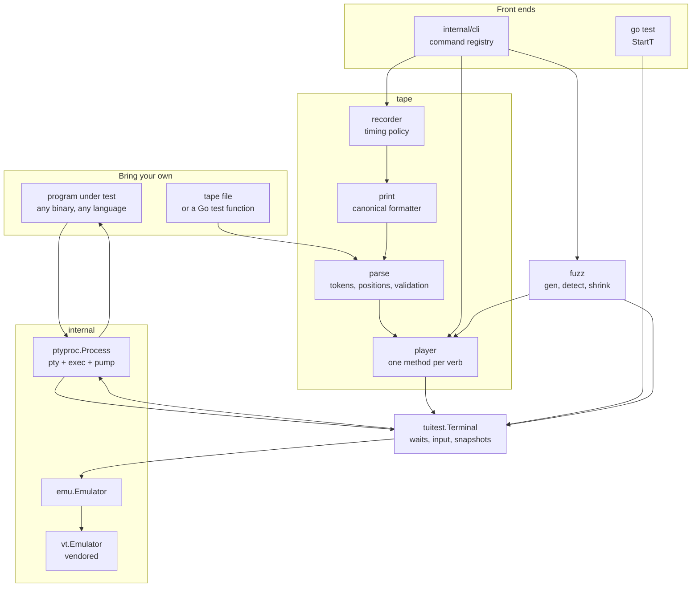
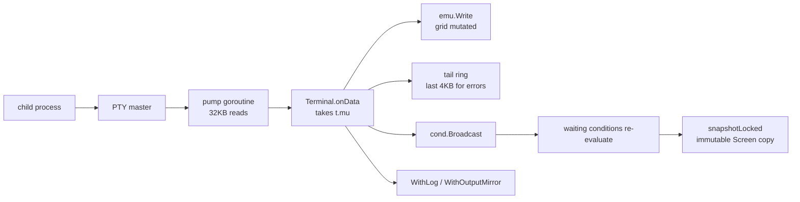
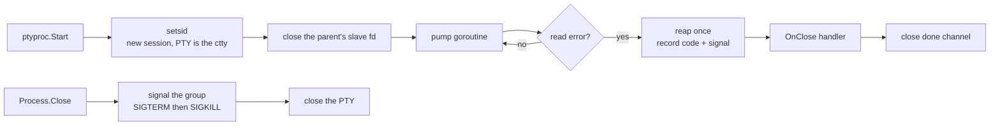

# Architecture

tuitest is one public package and five internal or auxiliary ones. Each has a
single responsibility and a narrow seam to the next, so any one of them can be
read, tested, or replaced without the others.

## Packages

| Package | Responsibility |
| --- | --- |
| [`.`](../terminal.go) (root) | `Terminal`: spawn options, input, waits, screen snapshots, goldens, terminal state |
| [`internal/ptyproc`](../internal/ptyproc/ptyproc.go) | PTY allocation, `exec` lifetime, the output pump, resize, process-group teardown |
| [`internal/emu`](../internal/emu/emu.go) | The `Emulator` interface and the adapter onto the vendored VT |
| [`internal/vt`](../internal/vt) | The VT interpreter itself, copied from tuios (see [VENDOR.md](../internal/vt/VENDOR.md)) |
| [`tape`](../tape/parse.go) | The tape language: parser, player, recorder, printer, replay renderer |
| [`internal/cli`](../internal/cli/cli.go) | The command registry, flag parsing, exit codes, JSON output, diagnostics |
| [`fuzz`](../fuzz/fuzz.go) | Input generation, failure detection, delta-debugging minimisation, corpus |
| [`tuiosx`](../tuiosx/tuiosx.go) | tuios-specific spawn and chord helpers; nothing in the core depends on it |

## Whole system

Two facts about this picture are worth stating in words.

First, the fuzzer does not have its own execution path. It generates
`tape.Command` values and replays candidates through the same player that
`tuitest run` uses. A minimised reproduction is therefore not a description of
what the fuzzer did, it is the identical execution, which is what makes the
generated tape trustworthy as a committed regression test.

Second, the recorder's output goes back through the parser in the round-trip
tests (`tape/roundtrip_test.go`, `tape/print_roundtrip_test.go`). Anything the
recorder can write, the parser can read, and printing a parsed tape reproduces
it. That closes the loop between `record` and `run` at the type level rather
than by convention.

## The read path

One goroutine reads the PTY master, and it is the only writer to the emulator.
Callbacks are never concurrent with each other, so `Terminal` only guards the
state that waits also read. Waiting conditions are evaluated while holding the
same lock the pump took, which is why a condition can never observe a torn grid,
and why `Screen` values handed to a `WaitFor` callback are safe to keep.

`snapshotLocked` copies the whole grid, so it is proportional to `cols * rows`.
Conditions that do not need a grid, such as `WaitStable` and `WaitForOutput`,
deliberately do not call it: during a heavy output burst they would otherwise
rebuild the screen on every 32KB chunk.

`WithLog` mirrors both directions and is what `StartT` wires to `t.Log`.
`WithOutputMirror` carries only what the program wrote, which is how `record`
and `replay` render the program onto a real terminal while the harness still
drives it headlessly.

## The write path

Input goes through one function, `Terminal.write`, which mirrors to the debug
log, timestamps `lastInput`, and hands the bytes to the PTY. The timestamp is
load-bearing: `WaitStable` measures its quiet window from the later of the last
output byte and the last input sent, so calling it straight after `SendKeys`
cannot report the pre-keystroke screen as stable. `Resize` takes the same path
for the same reason, since the redraw it provokes has not arrived yet.

## Process lifetime

Closing the parent's copy of the slave descriptor immediately after start is
what makes EOF happen at all: without it the parent keeps the slave open and the
master read blocks forever after the child exits.

The ordering at the end is deliberate. `OnClose` runs before `done` is closed,
so a caller woken by `Done()` cannot observe a `Terminal` that has not yet been
told the child is gone. `ExitCode` consults the process first and the terminal's
own copy second, closing the same window from the other side.

Teardown signals the process group rather than the process. That is the property
that makes tuitest usable against a multiplexer: a plain `Process.Kill` would
leave the daemon and every pane process running after the test.

## Errors

Failure types are structured rather than formatted strings, and each unwraps to
a sentinel so callers can branch without a type assertion.

| Type | Sentinel | Raised when |
| --- | --- | --- |
| `*tuitest.TimeoutError` | `ErrTimeout` | a wait ran out of time |
| `*tuitest.ClosedError` | `ErrChildExited` | the child exited before the condition held |
| (wrapped) | `ErrSemanticMarkers` | an OSC 133 wait without `WithSemanticMarkers` |
| `*tape.ParseError` | | a tape line would not parse |
| `*tape.LineError` | | any command failed, carrying its line number |
| `*tape.AssertionError` | | `ExpectExit`, or any other verb-level assertion |
| `*tape.ExpectError` | | an `Expect` regex did not match |
| `*tape.SnapshotError` | | a `Snapshot` did not match its golden |

The last three implement `tape.AssertionFailure`, an interface whose marker
method is unexported so only the `tape` package can claim the meaning. The CLI
maps every implementation to the assertion exit code, which means adding a new
assertion error type cannot silently start reporting a harness failure.
`SnapshotError` and `ExpectError` keep the two screens apart rather than
pre-rendering a diff, so `tuitest replay` can print them side by side while a
headless run still gets the unified diff from `Error()`.

`internal/cli.classify` maps these onto exit codes. The interesting judgement
there is `ClosedError`: a program that exits before a wait is satisfied is
counted as an assertion failure (exit 1), not a harness error (exit 3), because
the harness did its job and the program did not do what the tape said it would.
