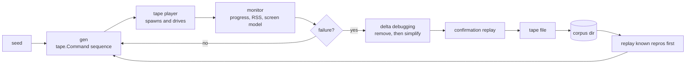

# Fuzzing a TUI

`tuitest fuzz` drives a program with randomised but structured input and reports
the ways a TUI breaks. When it finds something it minimises the input and writes
a tape file that replays it, because a fuzzer that reports a failure without a
reproduction is not actionable.

```
tuitest fuzz -- ./myapp
tuitest fuzz -seed 42 -iterations 200 -corpus testdata/fuzz -- ./myapp
tuitest fuzz -duration 5m -exclude Ctrl+c -- ./myapp
```

## The loop



Everything the fuzzer sends is a `tape.Command`, and candidates replay through
the same player `tuitest run` uses. That is what makes a reproduction
trustworthy: it is not a description of what the fuzzer did, it is the same
execution path, and the file it writes runs under `tuitest run` with no
fuzz-specific tooling.

With `-corpus dir`, findings are saved there and replayed first on the next run,
which turns them into a regression suite: a fix is confirmed when the corpus
stops reproducing.

## What it sends

Structured input, not byte noise.

**Text** mixing ASCII, accented Latin (`café`, `über`), CJK and other
double-width scripts (`你好`, `こんにちは`, `한글`), multi-codepoint emoji
including ZWJ sequences and regional indicators, combining marks, zero-width and
bidi-override characters, an embedded tab and newline, and a 200-character run
of one letter. Width handling is where TUI layout code most often goes wrong.

**Keys**: navigation and editing (`Up`, `PageDown`, `Home`, `Backspace`,
`Insert`, ...), `F1` through `F12`, and a set of control chords. `Ctrl+c` is
included on purpose even though it usually quits, because the
terminal-restoration check can only run on a program that has exited, so a
generator that never asks a program to quit can never find the single most
common TUI bug. `Ctrl+z` is omitted entirely: suspending the child under a PTY
wedges the run rather than finding anything about the program. `-exclude
Ctrl+c,q` turns off whatever quits your program too early.

**Mouse**: clicks, wheel notches, and coherent drags (press, move, release with
the same button), including coordinates outside the grid.

**Resizes** weighted toward degenerate sizes: `1x1`, `1x24`, `80x1`, `2x1`,
`500x1`, `1x500`, `1000x1000`, alongside ordinary ones. These are where layout
arithmetic divides by zero or indexes out of range.

**Hostile bytes**, unless `-no-hostile`. A TUI parses its own stdin looking for
key and mouse sequences, and that parser sees bytes it did not produce:
truncated and unterminated escape sequences, malformed UTF-8 (bare continuation
bytes, overlong encodings, surrogate halves), enormous parameter counts, and
numeric parameters far past what fits in an integer.

## What it detects

| Finding | What it means |
| --- | --- |
| `crash` | The program died from a fault signal or exited non-zero. |
| `hang` | The program is alive but stopped answering input. |
| `dirty-terminal` | It exited without restoring the terminal. |
| `screen-inconsistent` | The screen model contradicts itself: the cursor outside the grid, or the grid changing size without a resize. |
| `memory-growth` | Resident memory grew past `-max-memory-growth` (Linux only, off by default). |
| `replacement-char` | U+FFFD reached the screen after only well-formed input (`-detect-replacement-chars`, off by default). |
| `invariant` | An invariant you supplied returned an error (Go API only). |

A clean exit is never a finding: the fuzzer sends keys that legitimately quit a
program, and treating that as a bug would make every run a false positive.

`dirty-terminal` is the highest-value check in practice. It is a real bug class,
it is common, and unlike the others it has almost no false-positive surface,
because a program that turned a mode on is unambiguously responsible for turning
it off. It fires on the alternate screen, mouse tracking, bracketed paste, focus
reporting, or a hidden cursor left set after exit, and `-allow-dirty-exit`
suppresses it for programs that are not full-screen and never claimed to restore
anything.

`memory-growth` is off unless you ask for it, because it is a ratio and ratios
are noisy. Even when enabled it ignores programs under a 16MB floor, so a
program starting at a few hundred kilobytes does not trip on allocator noise.

### Replacement characters

`-detect-replacement-chars` reports U+FFFD on screen. Reaching the grid means
the program decoded a byte sequence it could not represent and substituted the
replacement character, so the text the user is looking at is not the text the
program meant to draw. The usual cause is a fixed-size read buffer cutting a
multi-byte rune in half, which is why the generator sends CJK and emoji.

It is off by default, and the reason is worth stating plainly: **the generator
sends malformed UTF-8 on purpose, and against malformed input a replacement
character is the correct output rather than a bug.** Hostile bursts carry bare
continuation bytes, overlong encodings and surrogate halves, and `Raw` text is
truncated mid-rune one time in ten. A program that draws U+FFFD for those bytes
is doing exactly the right thing.

So the check is gated: once any malformed byte, or a literal U+FFFD, has been
sent in a run, the check goes quiet for the rest of that run. There is no bound
on how long a program may hold input before drawing it, so a per-command gate
would not be sound. In practice that means pairing it with `-no-hostile`, and
even then the mid-rune truncation will silence some runs. What is left is the
case worth having, and it is the one that finds real bugs: well-formed text in,
mangled text out.

It reads the rendered line rather than the raw cells, so a cell hidden with
SGR 8 is not reported as a character nobody can see.

### Invariants

An invariant is a property of the screen you expect the program to maintain,
supplied from Go:

```go
res, err := fuzz.Run(ctx, fuzz.Options{
    Argv: []string{"./myapp"},
    Iterations: 200,
    Invariants: []fuzz.Invariant{{
        Name: "status bar is present",
        Check: func(sc tuitest.Screen) error {
            if _, exited := sc.ExitCode(); exited {
                return nil
            }
            if cols, rows := sc.Size(); cols < 40 || rows < 5 {
                return nil
            }
            if strings.Contains(sc.Text(), "F1 Help") {
                return nil
            }
            return errors.New("the status bar is gone")
        },
    }},
})
```

This is the only oracle the fuzzer has that knows anything about your program.
Without it a session can find that the program died, wedged, or dirtied the
terminal; with it a session can find that a modal was left open, that a border
stopped closing, or that a count went negative. A violated invariant is an
ordinary finding: it is minimised by the same shrinker, deduplicated by name,
and written to the corpus like any other.

**It is a Go-API feature.** A tape file cannot carry a Go closure, so there is
no CLI flag and no tape verb for it.

**When it is checked.** The invariant runs after every command, but a violation
is only reported once it has survived a settle: a `WaitStable`, or the settle at
the end of the iteration. The fuzzer sends input far faster than a program
consumes it, so between two ordinary commands the screen is routinely a
half-drawn frame, and a reasonable invariant fails against one. Reporting there
would bury real findings under redraw noise. `WaitOutput` deliberately does not
count as a settle: it returns on the first byte of a frame, which is the
opposite of quiesced. This was measured, not assumed; treating it as a settle
produced exactly that false positive, because a resize to a thousand rows takes
longer to draw than the 200ms bound the generator puts on it.

The consequence is that a violation which occurs and then repairs itself before
the end of the iteration is missed. That is the deliberate side of the trade.

An invariant is also not evaluated until the program has drawn something. Before
that the grid is the blank screen the emulator started with, every reasonable
invariant fails against it, and the shrinker would minimise every finding down
to `Spawn` alone.

**The report says when it broke, not when it was noticed.** A finding carries an
onset: the index of the command after which the property first failed and stayed
failed. That is what makes it actionable, and it is what the corpus header
points at. The onset lags the cause by a command or two, because a violation only
becomes observable once the program has redrawn.

**What you have to write yourself.** Guards. The fuzzer sends `Ctrl+c`, so a
program that has exited has no screen to hold up and the invariant must say so.
The fuzzer resizes to a single column and a single row, where a layout property
no program maintains, so an invariant about chrome has to go vacuous at a size
where the chrome cannot fit. This is the real cost of the feature: an
under-guarded invariant produces false positives, and an over-guarded one goes
vacuous on exactly the degenerate sizes the fuzzer favours and is checked on
almost nothing.

Hang detection is the one heuristic, and it is deliberately conservative. A
program is allowed to ignore input, so silence alone proves nothing: the check
requires several unanswered input events and then waits the full grace period
(`-hang-after`, 5s by default) for a response. It is tuned to avoid false
positives rather than to catch every hang, so it will miss a wedge whose
evidence is muddied by output that was already in flight.

## Minimisation

Two passes run to exhaustion against a hard budget of candidate replays
(`-shrink-budget`, 200 by default), because every candidate costs a full
spawn-and-drive.

The first pass deletes chunks in decreasing sizes, the classic delta debugging
shape: a fuzz run is mostly irrelevant input, so the cheapest big win is
deleting half of it, and the pass narrows until it is removing single commands.
The `Spawn` is protected, so minimisation cannot produce a tape that runs
nothing.

The second pass simplifies the commands that survive, each of which has a small
ladder of strictly simpler forms; the first form that still reproduces wins.
This is what turns a 400-byte hostile payload into the three bytes that actually
matter.

A candidate counts as reproducing only when it produces the same `FailureKind`,
which is why the kinds are coarse. Invariant failures carry the invariant's name
as well, so a session watching several properties cannot drift onto whichever
one is easiest to break and hand back a reduction for a property nobody asked
about. After minimisation the result is replayed
once more to confirm; a finding that does not re-verify is still reported but
labelled, because a flaky finding is worth less than a solid one.

## Reproductions

```
# crash: program killed by aborted
# found by tuitest fuzz at seed 13064056694810536104, iteration 6
# minimised from 31 commands to 3
#
# replay with: tuitest run <this file>

Spawn htop
Resize 1 1
Raw "hel"
```

That is a real reproduction, minimised from 31 commands to 3. It is a buffer
overflow in htop 3.5.1, caught by glibc's fortify check.

An invariant reproduction also carries the onset in its header, pointing at the
command in the minimised tape after which the property first failed.

Only crash and dirty-exit reproductions carry an assertion. Those end in
`ExpectExit 0`, so the file is red until the bug is fixed. A hang, a screen
inconsistency and memory growth are judged from outside the tape by watching the
process, and any in-tape liveness probe would mean sending input the fuzzer did
not send, so those files are transcripts and say so in their header. Rerun
`tuitest fuzz` against the corpus to check a fix for them.

## Limits

Generation is blind. There is no coverage instrumentation of the program under
test, so input comes from a structural model rather than being steered toward
new code paths. It finds shallow bugs quickly and deep ones only by luck, and
raising `-iterations` has diminishing returns much sooner than a coverage-guided
fuzzer would.

Both oracles above are gated rather than continuous, and each gate costs
coverage. The replacement-character check goes quiet for a whole run as soon as
one malformed byte is sent, which with the default generator is almost
immediately. An invariant is judged only at a settle, so a violation that
repairs itself before the end of the iteration is never seen. Both gates were
chosen over the alternative because a fuzzer that reports things that are not
bugs trains you to stop reading its output, and neither check is worth that.

An invariant finding is also no more solid than any other: the confirmation
replay drives a real program through a real PTY, and a reproduction whose last
few commands race the program's redraw will sometimes fail to re-verify. Those
are reported and labelled rather than hidden. See
[docs/limits.md](limits.md).

## Testing the fuzzer

The fuzzer is verified against `testdata/buggytui`, a fixture with individually
selectable bugs: a panic on one key, a wedge at one column, an exit that leaves
the alternate screen and mouse tracking on, an echo path that truncates input
mid-rune and so draws U+FFFD from well-formed text, and a mode toggle that hides
part of the interface and never restores it. The tests assert that it finds
each, that it minimises a tape which replays it, that it stays silent on
the same fixture's well-behaved mode across several seeds, and that a session
reaps every process it spawns. The minimisation strategy is tested separately
against an injected predicate rather than a real program, so those tests do not
depend on any program's timing.
