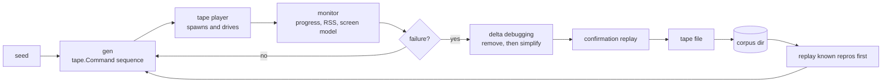

# Fuzzing a TUI

`tuitest fuzz` drives a program with randomised but structured input and reports
the ways a TUI breaks. When it finds something it minimises the input and writes
a tape file that replays it, because a fuzzer that reports a failure without a
reproduction is not actionable.

```
tuitest fuzz -- ./myapp
tuitest fuzz -seed 42 -iterations 200 -corpus testdata/fuzz -- ./myapp
tuitest fuzz -duration 5m -exclude Ctrl+c -- ./myapp
```

## The loop



Everything the fuzzer sends is a `tape.Command`, and candidates replay through
the same player `tuitest run` uses. That is what makes a reproduction
trustworthy: it is not a description of what the fuzzer did, it is the same
execution path, and the file it writes runs under `tuitest run` with no
fuzz-specific tooling.

With `-corpus dir`, findings are saved there and replayed first on the next run,
which turns them into a regression suite: a fix is confirmed when the corpus
stops reproducing.

## What it sends

Structured input, not byte noise.

**Text** mixing ASCII, accented Latin (`café`, `über`), CJK and other
double-width scripts (`你好`, `こんにちは`, `한글`), multi-codepoint emoji
including ZWJ sequences and regional indicators, combining marks, zero-width and
bidi-override characters, an embedded tab and newline, and a 200-character run
of one letter. Width handling is where TUI layout code most often goes wrong.

**Keys**: navigation and editing (`Up`, `PageDown`, `Home`, `Backspace`,
`Insert`, ...), `F1` through `F12`, and a set of control chords. `Ctrl+c` is
included on purpose even though it usually quits, because the
terminal-restoration check can only run on a program that has exited, so a
generator that never asks a program to quit can never find the single most
common TUI bug. `Ctrl+z` is omitted entirely: suspending the child under a PTY
wedges the run rather than finding anything about the program. `-exclude
Ctrl+c,q` turns off whatever quits your program too early.

**Mouse**: clicks, wheel notches, and coherent drags (press, move, release with
the same button), including coordinates outside the grid.

**Resizes** weighted toward degenerate sizes: `1x1`, `1x24`, `80x1`, `2x1`,
`500x1`, `1x500`, `1000x1000`, alongside ordinary ones. These are where layout
arithmetic divides by zero or indexes out of range.

**Hostile bytes**, unless `-no-hostile`. A TUI parses its own stdin looking for
key and mouse sequences, and that parser sees bytes it did not produce:
truncated and unterminated escape sequences, malformed UTF-8 (bare continuation
bytes, overlong encodings, surrogate halves), enormous parameter counts, and
numeric parameters far past what fits in an integer.

## What it detects

| Finding | What it means |
| --- | --- |
| `crash` | The program died from a fault signal or exited non-zero. |
| `hang` | The program is alive but stopped answering input. |
| `dirty-terminal` | It exited without restoring the terminal. |
| `screen-inconsistent` | The screen model contradicts itself: the cursor outside the grid, or the grid changing size without a resize. |
| `memory-growth` | Resident memory grew past `-max-memory-growth` (Linux only, off by default). |

A clean exit is never a finding: the fuzzer sends keys that legitimately quit a
program, and treating that as a bug would make every run a false positive.

`dirty-terminal` is the highest-value check in practice. It is a real bug class,
it is common, and unlike the others it has almost no false-positive surface,
because a program that turned a mode on is unambiguously responsible for turning
it off. It fires on the alternate screen, mouse tracking, bracketed paste, focus
reporting, or a hidden cursor left set after exit, and `-allow-dirty-exit`
suppresses it for programs that are not full-screen and never claimed to restore
anything.

`memory-growth` is off unless you ask for it, because it is a ratio and ratios
are noisy. Even when enabled it ignores programs under a 16MB floor, so a
program starting at a few hundred kilobytes does not trip on allocator noise.

Hang detection is the one heuristic, and it is deliberately conservative. A
program is allowed to ignore input, so silence alone proves nothing: the check
requires several unanswered input events and then waits the full grace period
(`-hang-after`, 5s by default) for a response. It is tuned to avoid false
positives rather than to catch every hang, so it will miss a wedge whose
evidence is muddied by output that was already in flight.

## Minimisation

Two passes run to exhaustion against a hard budget of candidate replays
(`-shrink-budget`, 200 by default), because every candidate costs a full
spawn-and-drive.

The first pass deletes chunks in decreasing sizes, the classic delta debugging
shape: a fuzz run is mostly irrelevant input, so the cheapest big win is
deleting half of it, and the pass narrows until it is removing single commands.
The `Spawn` is protected, so minimisation cannot produce a tape that runs
nothing.

The second pass simplifies the commands that survive, each of which has a small
ladder of strictly simpler forms; the first form that still reproduces wins.
This is what turns a 400-byte hostile payload into the three bytes that actually
matter.

A candidate counts as reproducing only when it produces the same `FailureKind`,
which is why the kinds are coarse. After minimisation the result is replayed
once more to confirm; a finding that does not re-verify is still reported but
labelled, because a flaky finding is worth less than a solid one.

## Reproductions

```
# crash: program killed by aborted
# found by tuitest fuzz at seed 13064056694810536104, iteration 6
# minimised from 31 commands to 3
#
# replay with: tuitest run <this file>

Spawn htop
Resize 1 1
Raw "hel"
```

That is a real reproduction, minimised from 31 commands to 3. It is a buffer
overflow in htop 3.5.1, caught by glibc's fortify check.

Only crash and dirty-exit reproductions carry an assertion. Those end in
`ExpectExit 0`, so the file is red until the bug is fixed. A hang, a screen
inconsistency and memory growth are judged from outside the tape by watching the
process, and any in-tape liveness probe would mean sending input the fuzzer did
not send, so those files are transcripts and say so in their header. Rerun
`tuitest fuzz` against the corpus to check a fix for them.

## Limits

Generation is blind. There is no coverage instrumentation of the program under
test, so input comes from a structural model rather than being steered toward
new code paths. It finds shallow bugs quickly and deep ones only by luck, and
raising `-iterations` has diminishing returns much sooner than a coverage-guided
fuzzer would.

## Testing the fuzzer

The fuzzer is verified against `testdata/buggytui`, a fixture with individually
selectable bugs: a panic on one key, a wedge at one column, and an exit that
leaves the alternate screen and mouse tracking on. The tests assert that it
finds each, that it minimises a tape which replays it, that it stays silent on
the same fixture's well-behaved mode across several seeds, and that a session
reaps every process it spawns. The minimisation strategy is tested separately
against an injected predicate rather than a real program, so those tests do not
depend on any program's timing.
